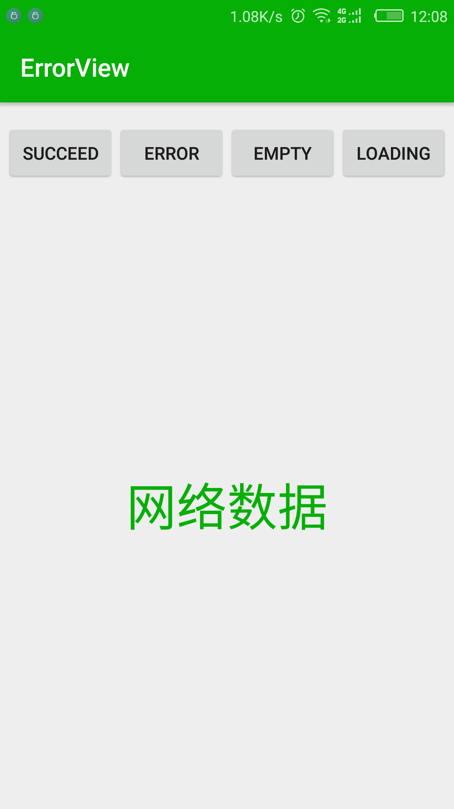
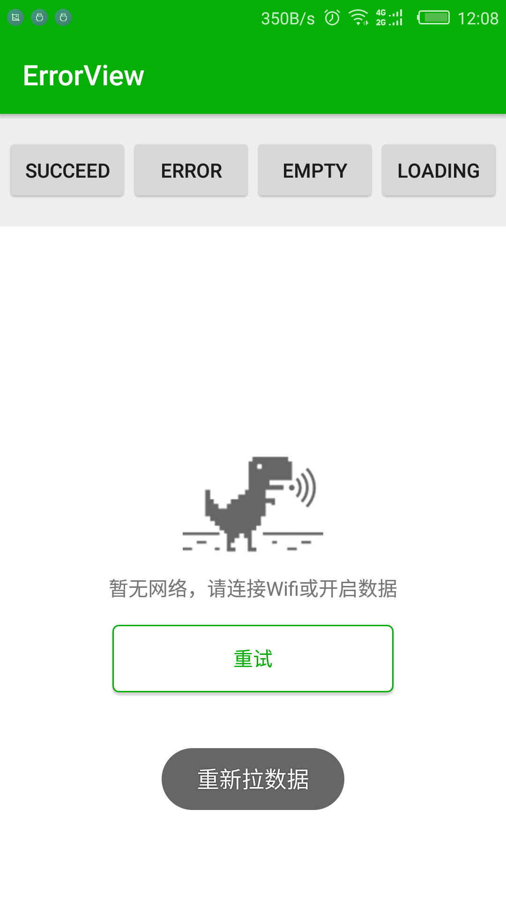
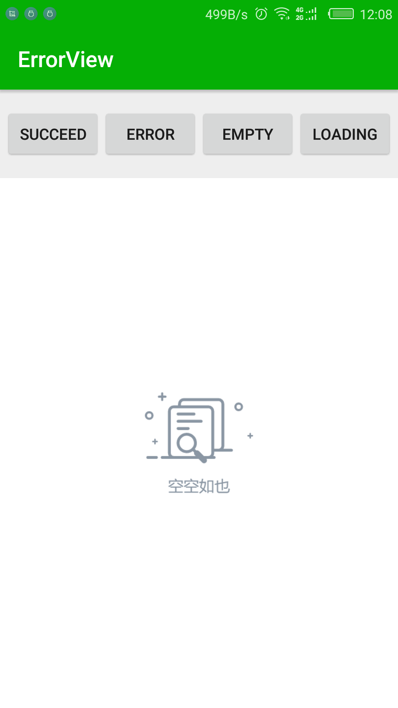
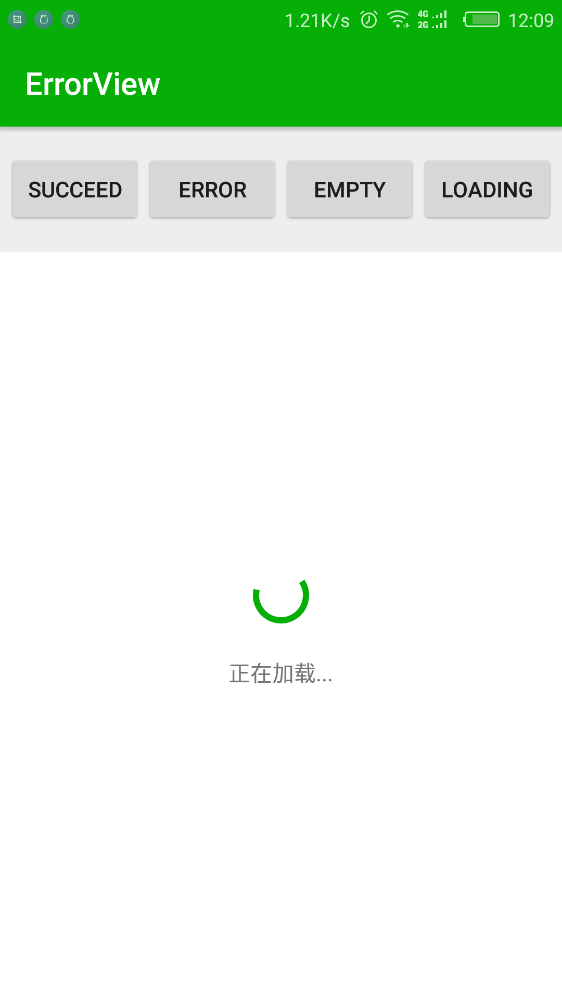
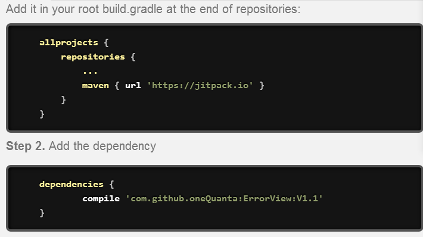

# ErrorView
错误的界面，成功界面，空界面，加载页面

##	什么都不说，先亮效果图
	

	

## 依赖添加

##	使用方式
* 添加依赖 compile 'com.github.oneQuanta:ErrorView:V1.1'
* 添加仓库 maven { url 'https://jitpack.io' }
* [可以在BaseActivity 中的onCreate 方法中创建 创建VaryViewHelper的对象并实现两个方法](https://github.com/oneQuanta/ErrorView/blob/master/app/src/main/java/com/pomelo/errorview/BaseActivity.java)  记得释放资源
* 自定义UI 只需在[app](https://github.com/oneQuanta/ErrorView/blob/master/app/src/main/java/com/pomelo/errorview/app.java)中添加
			
	        VaryViewUtil
                .ViewBuilder
                .Builder()
                .setEmptyViewId(R.layout.layout_emptyview)	//空的界面
                .setErrorViewId(R.layout.layout_errorview)	//错误的界面
                .setLoadingViewId(R.layout.layout_loadingview);	//加载时候的界面